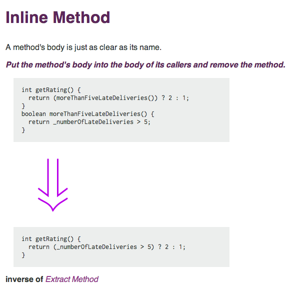

# Long Refactorings
## Rick Bradley

---

### github.com/rick

---

## long refactorings
 

---

## long refactorings are simply refactorings
### only, (IN HINDSIGHT) they end up taking a lot longer than most refactorings

---

### Stepping back for a second...
## What *is* "refactoring"?

---

## Refactoring...

 

### behavior-preserving changes to the implementation of a system

---

---

 

 

 

`http://refactoring.com/catalog/extractMethod.html`

---

 

 

 

`http://refactoring.com/catalog/inlineMethod.html`

---

## why do we refactor?

---

### wankery

---

### to understand the system

---

### to understand the system
### to bring behavior under test

---

### to understand the system
### to bring behavior under test
### to extract code for reuse

---

### to understand the system
### to bring behavior under test
### to extract code for reuse
### to improve some facet of the system (performance, memory use, coupling, cohesion, etc., etc., etc.)

---

### to understand the system
### to bring behavior under test
### to extract code for reuse
### to improve some facet of the system (performance, memory use, coupling, cohesion, etc., etc., etc.)
### to reuse existing code elsewhere

---

### to understand the system
### to bring behavior under test
### to extract code for reuse
### to improve some facet of the system (performance, memory use, coupling, cohesion, etc., etc., etc.)
### to reuse existing code elsewhere
### to make room for a new feature

---

### to understand the system
### to bring behavior under test
### to extract code for reuse
### to improve some facet of the system (performance, memory use, coupling, cohesion, etc., etc., etc.)
### to reuse existing code elsewhere
### to make room for a new feature
### to prepare to fix a bug

---

### to understand the system
### to bring behavior under test
### to extract code for reuse
### to improve some facet of the system (performance, memory use, coupling, cohesion, etc., etc., etc.)
### to reuse existing code elsewhere
### to make room for a new feature
### to prepare to fix a bug
### ...

---

### to understand the system
### to bring behavior under test
### to extract code for reuse
### to improve some facet of the system (performance, memory use, coupling, cohesion, etc., etc., etc.)
### to reuse existing code elsewhere
### to make room for a new feature
### to prepare to fix a bug
## wankery

---

## optimization
 
 

---

## optimization
 
### no, I mean, life optimization

---

## refactoring a toy system

---

## refactoring a toy system

### it could be for learning purposes
### or perhaps the hope is that some day it will grow up to be a big system
#### one that someone has a use for

---

## refactoring a toy system

### The value is in building something useful
### Even here, though, we have finite time and resources
### So we choose what to work on

---

## refactoring a system that people are actively using

---

### Again, limited time and resources,
### so we must make choices about what to work on,
### because the time spent on one thing cannot be spent on another.

---

## wankery is a waste of resources.

---

## refactoring to understand a system
### is useful if it is directed towards implementing a feature or fixing a bug

---

## refactoring to bring behavior under test
### is wasteful, unless it's being immediately driven by fixing a bug or implementing a feature

---

## refactoring to extract code for reuse
### is wasteful, unless we have reached the point where a new feature is ready to use that extraction

---

## refactoring to improve some facet of the system
### is generally a good reason to refactor, if this is the most important thing you could be working on right now

---

## refactoring to make room for a new feature
### is great, presuming you're implementing that feature right now

---

## refactoring to prepare to fix a bug
### also great, if you're fixing the bug right now

---

## optimization
### part deux

---

## most refactorings are small or trivial

 

### There's really no estimation involved:
### look at the code, start making the changes.

 

### We're using techniques in Martin Fowler's _Refactoring_ book.

 

### The refactorings are a commit or few,
### inside the boundary of a larger pull request,
### dedicated to a feature or a bugfix.

---

## Image credits:

https://www.flickr.com/photos/mozul/31304173/
https://www.flickr.com/photos/uspn/4894253589/

---

     - many, maybe even most, refactorings are trivial, or at least small
       - there's really no estimation involved -- look at the code, start making the changes
       - we're using techniques in Martin Fowler's _Refactoring_ book, basically
       - the refactorings are a commit or few, inside the boundary of a larger pull request, dedicated to a feature or a bugfix

     - a lot of refactorings are a little larger, suitable for a pair of programmers sitting down one afternoon
       - we can typically estimate them, or do without estimation altogether
       - we can knock them out pretty quickly
       - we can use simple tools and processes:
         - cut a feature branch
         - supplement tests, refactor to tests
         - do pair programming
         - start with a pull request for the main feature or bugfix
         - kick off a pull request for the refactoring, cc-ing between the PRs; this lands, and we go back to the main PR
         - we begin to use techniques like those found in Michael Feather's _Working Effectively with Legacy Code_

     - then we begin to escalate into refactorings that we know are projects:
       - even the process of estimation can be difficult
       - we know that these refactorings are non-trivial, and it's not even clear sometimes whether
       - we are only considering them because really important features are being roadblocked
         - or there are bugs and quality issues in this part of the system, which never seem to be resolved piecemeal
         - or everyone who tries to implement features in this area backs off, steps back muttering, becomes angry and turns to drink
       - we find ourselves using things like _The Mikado Method_ to even explore the possible refactorings:
       - we do throw-away experimental refactorings of a smaller scope just to see if a large refactoring might be possible here
       - we spec out possible alternate architectures as proofs of concept
       - various people in ones and twos take these stabs at feasibility over the course of months or years

    - those hellacious refactorings are what this talk is about

  - how can we succeed at these sort of major refactorings?
    - there are so many risks that it's actually unlikely you'll succeed
    - so aim to minimize costs
    - aim to never be a roadblock
    - aim to never build a Second System, the promised land of endless biscuits and gravy
    - aim to integrate constantly
    - avoid Flag Day
    - be like water (flow with whatever is happening, making incremental improvements all the way)
    - when the refactoring "lands", there should be zero risk, because it's already been in place for months

  - let's get real
    - we refactored the entirety of the GitHub permissioning, teams, and organizations system over 22 months
      - link to abilities issues list
      - any d3 stuff we've got
    - why?
      - I (and my OGC cohorts -- Kevin Barnes and Yossef Mendelssohn) were hired by @defunkt and @schacon to "do a rescue mission, on GitHub.com"
      - that might have been tongue-in-cheek, and I'll chalk it up to cocktails and endless sake at Urban Grub & pm, but there's still a lot of truth in a need to work at scale on systems with nontrivial technical debt
      - I spent about 5 months working on the system and looking for the points of pain -- the places where bugs were prevalent, code quality was low, and the difficulty of working on the system
      - Over the course of working on bugs in a number of places, it became clear that our permissioning system was bit-rotting
        - leaky behavior - still see cached notifications or stars or mentions or, etc., on repositories you no longer had access to
        - dashboards showing weird results, job queue jobs failing, help tickets related to permissions, etc.
        - poor performance on some queries, slowing the system down
        - developers not being able to reliably fix things in this area, not having a strategy on how to fix things
      - began to dig in and map out things, try candidate small refactorings on certain areas, floating larger refactoring projects to get things under control
        - https://github.com/github/github/pull/6087
          - especially "permission from the boss": https://github.com/github/github/pull/6087#issuecomment-8670691
        - https://github.com/github/github/issues/5072
        - https://github.com/github/github/issues/5362
        - https://github.com/github/github/pull/5143
        - https://github.com/github/github/issues/4565
        - https://github.com/github/github/pull/5077
      - more links to PRs
        - then @defunkt had long-range ideas about how organizations, etc., could be reworked (only some of which have landed so far) (link parts of his discussion)
      - that catalyzed a Big Project -- "Orgs Next" -- a business-level feature that is roadblocked by our permissioning system
      - we coalesced a team, really two teams -- a front-end user-facing team, and a back-end team working on removing the roadblocks to get there
      - Capabilities
      - Abilities
      - Science
      - Backscatter
      - parallel permissioning systems running
      - repository networks
      - data quality and cleanup
      - transitions, throttling
      - making everything available for enterprise
      - organization front-end changes without abilities (anti-corruption layers, etc.)
      - making abilities be the source of truth for reads on teams and orgs
      - making abilities be the source of truth for repositories
      - removing science: no longer traversing old permission query paths
      - eventual removal of update paths for old queries
      - enterprise systems running transitions, data quality scripts
  - rails3
    - ongoing (2011 -> now)
    - backporting strategy; overwhelmed by code changes; long branch
    - guard-based strategy to backport all version changes to master
    - aggressive graphing and logging
    - staying out of the way of enterprise branch points
    - reworking our script/* directory and configuration to allow toggling rails versions easily
  - smoke -> gitrpc
    - just completed, 2011 -> now
    - piecewise replacement of one git layer with another
    - graph instrumentation, exception tracking, extensive use of backscatter
    - gradual increase in callers of gitrpc -- 20%, 40%, 50%, 80%, 90%, 95%, 98%, 99%, 99.5%, 99.9%, .... 100%

 -> TODO: put the d3-type stuff here.

 -> something about team dynamics
 -> commitment to engineering over marketing, e.g.

 - need something conclusory...
